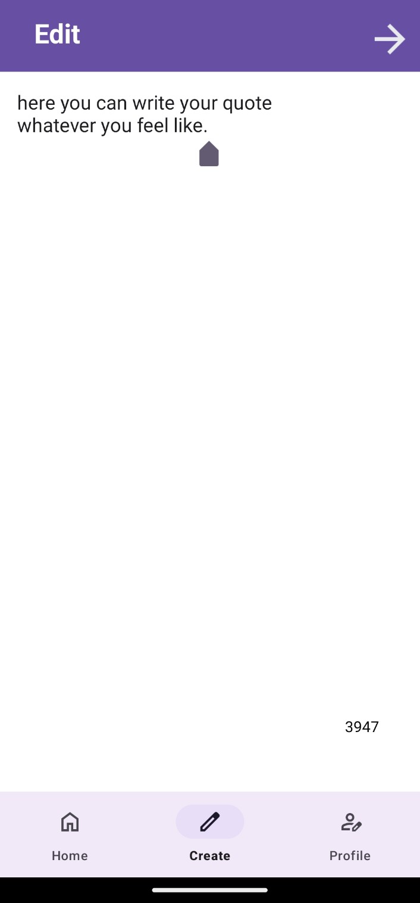

# KehGye

**KehGye** is an Android app where users can create, edit, and share quotes with background images. The app allows users to interact with posts by liking them, similar to Instagram. It includes user profiles, a home feed, and the ability to create new posts.

## Table of Contents
- [Project Overview](#project-overview)
- [Features](#features)
- [Installation](#installation)
- [Screenshots](#screenshots)
- [Technologies Used](#technologies-used)
- [Contributors](#contributors)

## Project Overview
KehGye is a quotes-writing app where users can create visually appealing posts with their favorite quotes and share them with the world. Users can also interact with each other's posts, follow profiles, and like posts.

## Features
- User authentication with Firebase
- Create and edit posts with custom background images
- Home feed with real-time posts
- Like functionality for posts
- User profiles with followers and following
- Post creation and editing functionality
<!-- - Weather integration using an API (if applicable) -->

## Installation
1. Clone the repository:
    ```bash
    git clone https://github.com/Rohitk2081/kehgye
    ```
2. Open the project in Android Studio.
3. Add your Firebase configuration file (`google-services.json`) in the `app/` directory.
4. Run the project on your device or emulator.

## Screenshots
Here are screenshots of the app's key screens to showcase its design and features:

| Splash Screen | Login Page | Registration Page |
|---------------|------------|-------------------|
|  |  |  |

| Home Screen | Profile Screen | Post Screen |
|-------------|----------------|-------------|
|  |  |  |

| Texting Screen | Editing Screen | 
|----------------|----------------|
|  |  | 

## Technologies Used
- **Android Studio**: Development environment for building the app.
- **Java**: Programming language used for developing the Android app.
- **Firebase Authentication**: For user sign-up and login functionalities.
- **Firebase Realtime Database**: To store user information and posts.
- **Firebase Firestore**: For real-time data synchronization of posts and user interactions.
- **Glide**: For efficient image loading and caching.
- **Retrofit**: For making API calls.

## Contributors
- [Rohit](https://github.com/Rohitk2081)
